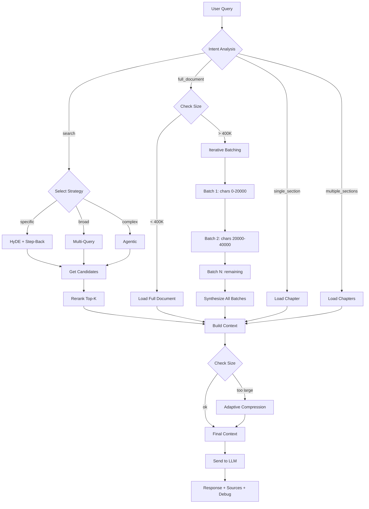
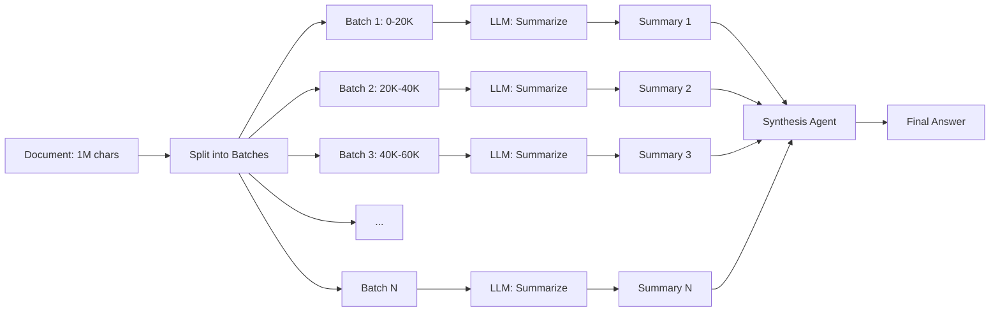
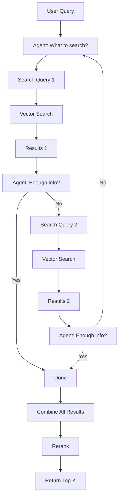

# 🧠 RAG Architecture - Полная Документация Системы

## 📋 Оглавление

1. [Обзор Системы](#обзор-системы)
2. [Архитектура Pipeline](#архитектура-pipeline)
3. [Агенты и Их Роли](#агенты-и-их-роли)
4. [Методы Поиска](#методы-поиска)
5. [Промпты Системы](#промпты-системы)
6. [Алгоритмы Выбора Чанков](#алгоритмы-выбора-чанков)
7. [Flow Диаграммы](#flow-диаграммы)
8. [Настройки и Параметры](#настройки-и-параметры)

***

## 🎯 Обзор Системы

### Что такое эта RAG система?

Это **умная многоуровневая система** для работы с документами, которая:

* 🧠 **Понимает намерения** пользователя через AI анализ
* 🔍 **Выбирает оптимальную стратегию** поиска автоматически
* 📚 **Обрабатывает любые объемы** документов (от параграфа до целой книги)
* 🎯 **Применяет продвинутые техники** RAG (HyDE, Multi-Query, Agentic, etc.)
* 🤖 **Использует агентов** для итеративного поиска и синтеза

### Основные Компоненты

```
┌─────────────────────────────────────────────────────────────┐
│                    USER QUERY                                │
│              "О чем 40 глава книги?"                         │
└─────────────────────┬───────────────────────────────────────┘
                      │
                      ▼
┌─────────────────────────────────────────────────────────────┐
│              🧠 INTENT ANALYZER (AI Agent)                   │
│  Анализирует запрос и определяет:                           │
│  • Scope: single_section / full_document / search           │
│  • Task: summarize / analyze / find_loopholes               │
│  • Sections: [40] или [] для поиска                         │
└─────────────────────┬───────────────────────────────────────┘
                      │
                      ▼
┌─────────────────────────────────────────────────────────────┐
│            📊 STRATEGY SELECTOR                              │
│  Выбирает метод поиска:                                     │
│  • Full Document Load                                       │
│  • Chapter Load                                             │
│  • Semantic Search (HyDE/Multi-Query/Agentic)              │
└─────────────────────┬───────────────────────────────────────┘
                      │
          ┌───────────┼───────────┐
          ▼           ▼           ▼
    ┌─────────┐ ┌─────────┐ ┌─────────┐
    │ FULL    │ │ CHAPTER │ │ SEARCH  │
    │ MODE    │ │ MODE    │ │ MODE    │
    └────┬────┘ └────┬────┘ └────┬────┘
         │           │           │
         └───────────┼───────────┘
                     │
                     ▼
         ┌───────────────────────┐
         │  CONTEXT BUILDER      │
         │  • Собирает контент   │
         │  • Добавляет citations│
         │  • Строит промпт      │
         └───────────┬───────────┘
                     │
                     ▼
         ┌───────────────────────┐
         │ ADAPTIVE COMPRESSION  │
         │ Сжимает под лимиты    │
         │ модели (70% window)   │
         └───────────┬───────────┘
                     │
                     ▼
         ┌───────────────────────┐
         │   FINAL RESPONSE      │
         │   + Sources + Debug   │
         └───────────────────────┘
```

***

## 🏗️ Архитектура Pipeline

### 1️⃣ Entry Point: `smart_rag_search()`

**Входные параметры:**

* `query` - запрос пользователя
* `user_email` - email пользователя
* `document_id` - ID документа (опционально)
* `max_tokens` - максимум токенов (default: 50,000)

**Что делает:**

1. Получает структуру документа (главы, чанки)
2. Вызывает Intent Analyzer
3. Выбирает стратегию на основе intent
4. Строит контекст
5. Применяет adaptive compression
6. Возвращает результат

### 2️⃣ Modes of Operation

| Mode | Когда используется | Что загружается |
|------|-------------------|-----------------|
| **Full Document** | "О чем вся книга?", "Перескажи весь документ" | Весь документ целиком (с автоматической batch обработкой для больших) |
| **Single Section** | "О чем глава 40?", "Что говорит статья 228?" | Одна глава/секция целиком |
| **Multiple Sections** | "Перескажи главы 1-5", "Сравни статьи 159 и 160" | Несколько глав целиком |
| **Comparison** | "Сравни главы X и Y" | Несколько секций с инструкциями для сравнения |
| **Semantic Search** | "Где упоминается X?", "Найди информацию о Y" | Top-K релевантных чанков через векторный поиск |

***

## 🤖 Агенты и Их Роли

### Агент #1: Intent Analyzer (AI-powered)

**Модель:** GPT-4o-mini\
**Задача:** Понять ЧТО хочет пользователь

**Промпт:**

```
Analyze this user query about a document and determine the best retrieval strategy.

USER QUERY: "{query}"

DOCUMENT STRUCTURE:
{structure_desc}

Analyze the query and return a JSON object with these fields:

1. "scope": One of:
   - "single_section": User wants a specific chapter/article/section
   - "multiple_sections": User wants several specific sections
   - "full_document": User wants to analyze the entire document
   - "comparison": User wants to compare different parts
   - "search": User is looking for specific information

2. "sections": Array of section identifiers the user wants
   - ["40"] for chapter 40
   - ["1", "2", "3"] for sections 1-3
   - [] for full document or search scope

3. "task": One of:
   - "summarize": Retell, summarize, explain content
   - "analyze": Deep analysis, themes, meaning
   - "find_loopholes": Find legal loopholes, exceptions
   - "find_contradictions": Find contradictions
   - "find_penalties": Find penalties, sanctions, fines
   - "compare": Compare sections
   - "search": Find specific information

4. "search_query": If scope is "search", provide optimized search query

5. "reasoning": Brief explanation of your analysis
```

**Примеры работы:**

| User Query | Scope | Sections | Task |
|------------|-------|----------|------|
| "О чем глава 40?" | single\_section | \["40"] | summarize |
| "Перескажи главы 1-5" | multiple\_sections | \["1","2","3","4","5"] | summarize |
| "О чем вся книга?" | full\_document | \[] | summarize |
| "Найди лазейки в законе" | search | \[] | find\_loopholes |
| "Сравни статьи 159 и 160" | comparison | \["159","160"] | compare |

**Fallback:** Если OpenAI API недоступен, используется regex-based анализ.

***

### Агент #2: HyDE Agent (Hypothetical Document Embeddings)

**Модель:** GPT-4o-mini\
**Задача:** Генерировать гипотетический документ для улучшения поиска

**Когда используется:**

* Query содержит "страница", "цитата", "абзац"
* Нужен точный поиск специфической информации

**Промпт:**

```
Given this question, write a detailed passage that would answer it.
Write as if you are quoting directly from a document that contains this information.
Be specific and detailed. Write 2-3 paragraphs.

Question: {query}

Hypothetical document passage:
```

**Как работает:**

1. Генерирует гипотетический текст-ответ
2. Создает embedding этого текста
3. Ищет реальные документы, похожие на гипотетический
4. Результат: более точные результаты для специфичных вопросов

**Пример:**

```
Query: "Что говорит закон о сроках давности?"

HyDE генерирует:
"Срок исковой давности составляет три года со дня, когда лицо 
узнало или должно было узнать о нарушении своего права. 
В некоторых случаях срок может быть продлен до десяти лет..."

Затем ищет документы, похожие на этот текст.
```

***

### Агент #3: Multi-Query Agent

**Модель:** GPT-4o-mini\
**Задача:** Генерировать несколько вариантов запроса для лучшего покрытия

**Когда используется:**

* Широкие вопросы ("о чем", "что такое", "обзор")
* Default стратегия для search mode

**Промпт:**

```
Generate {num_queries} different search queries based on this original query.
Each query should explore a different aspect or use different phrasing.

Original query: {query}

Generate queries that would help find comprehensive information.
Return as JSON array of strings.
```

**Как работает:**

1. Генерирует 3-4 альтернативных запроса
2. Выполняет поиск по каждому
3. Объединяет результаты (дедупликация по chunk\_id)
4. Rerank для финальной сортировки

**Пример:**

```
Original: "О чем глава про героя?"

Generated queries:
1. "главный герой характеристика описание"
2. "события с главным героем"
3. "развитие персонажа главного героя"
4. "роль главного героя в сюжете"
```

***

### Агент #4: Agentic Retrieval Agent

**Модель:** GPT-4o-mini\
**Задача:** Итеративно искать информацию, решая сам что искать дальше

**Когда используется:**

* Сложные вопросы, требующие несколько поисков
* Явно указано `strategy="agentic"`

**Промпт (цикл):**

```
You are a research agent helping to find information in documents.
Your task is to find information to answer: "{query}"

You have access to a document search tool. For each iteration:
1. Analyze what information you still need
2. Generate a specific search query
3. Review results and decide if you need more searches

Current search history:
{history}

Based on what you've found, what should be the next search query?
If you have enough information, respond with "DONE".

Next search query (or DONE):
```

**Как работает:**

1. Iteration 1: Агент решает что искать первым
2. Система выполняет поиск
3. Iteration 2: Агент смотрит результаты, решает нужно ли еще
4. Повторяет до 3 итераций или пока агент не скажет "DONE"
5. Возвращает все найденные результаты

**Пример:**

```
Query: "Каковы последствия нарушения статьи 228?"

Iteration 1: Агент ищет "статья 228 наказание санкции"
→ Находит 5 чанков

Iteration 2: Агент ищет "228 штраф лишение свободы сроки"
→ Находит 3 новых чанка

Iteration 3: Агент решает "DONE" (достаточно информации)

Итого: 8 уникальных чанков
```

***

### Агент #5: Step-Back Prompting Agent

**Модель:** GPT-4o-mini\
**Задача:** Генерировать более общий вопрос для контекста

**Когда используется:**

* Используется вместе с HyDE для специфичных вопросов

**Промпт:**

```
Given a specific question, generate a more general "step-back" question 
that would help understand the broader context needed to answer the original question.

Specific question: {query}

Step-back question (more general):
```

**Пример:**

```
Specific: "Какой штраф за повторное нарушение статьи 228?"

Step-back: "Какие вообще штрафы предусмотрены статьей 228?"
```

Система ищет по обоим вопросам и объединяет результаты.

***

### Агент #6: Reranking Agent

**Модель:** GPT-4o-mini\
**Задача:** Пересортировать результаты поиска по релевантности

**Когда используется:**

* ВСЕГДА после получения кандидатов
* Критически важен для точности

**Промпт:**

```
Rate how relevant each of these document chunks is to answering the query.
Rate from 0.0 (not relevant) to 1.0 (highly relevant).

Query: {query}

Documents:
[1] {chunk1}
[2] {chunk2}
...

Return JSON array of scores: [0.9, 0.7, 0.5, ...]
```

**Как работает:**

1. Получает 10-20 кандидатов от векторного поиска
2. LLM оценивает каждый от 0.0 до 1.0
3. Сортирует по новым оценкам
4. Возвращает top-K (обычно 5-10)

**Почему это важно:**

* Векторный поиск может давать ложные срабатывания
* LLM лучше понимает семантическую релевантность
* Повышает точность на 20-30%

***

## 🔍 Методы Поиска (Retrieval Strategies)

### 1. Vector Search (Semantic)

**Технология:** OpenAI Embeddings (text-embedding-3-small)\
**База данных:** Supabase + pgvector

**Как работает:**

```sql
-- Функция в PostgreSQL
CREATE FUNCTION search_document_chunks_v2(
    query_embedding vector(1536),
    match_count int,
    filter_user_id uuid,
    filter_document_id uuid,
    similarity_threshold float
)
RETURNS TABLE (
    id uuid,
    document_id uuid,
    content text,
    chunk_index int,
    metadata jsonb,
    similarity float
)
AS $$
    SELECT 
        id,
        document_id,
        content,
        chunk_index,
        metadata,
        1 - (embedding <=> query_embedding) as similarity
    FROM document_chunks
    WHERE user_id = filter_user_id
        AND (filter_document_id IS NULL OR document_id = filter_document_id)
        AND 1 - (embedding <=> query_embedding) > similarity_threshold
    ORDER BY embedding <=> query_embedding
    LIMIT match_count;
$$ LANGUAGE sql;
```

**Параметры:**

* Threshold: 0.5 (default) - минимальная схожесть
* Limit: 5-20 чанков
* Distance metric: Cosine similarity

***

### 2. Hybrid Search (BM25 + Vector)

**Технология:** PostgreSQL full-text search + pgvector

**Формула:**

```
final_score = (vector_weight × vector_score) + (keyword_weight × bm25_score)
```

**Параметры:**

* `vector_weight`: 0.7 (default) - вес семантического поиска
* `keyword_weight`: 0.3 (default) - вес keyword поиска

**SQL:**

```sql
CREATE FUNCTION hybrid_search_chunks_v2(
    query_text text,
    query_embedding vector(1536),
    match_count int,
    filter_user_id uuid,
    vector_weight float,
    keyword_weight float
)
RETURNS TABLE (...)
AS $$
    WITH vector_search AS (
        SELECT *, 1 - (embedding <=> query_embedding) as vector_score
        FROM document_chunks
        WHERE user_id = filter_user_id
    ),
    keyword_search AS (
        SELECT *, ts_rank(search_vector, plainto_tsquery(query_text)) as keyword_score
        FROM document_chunks
        WHERE user_id = filter_user_id
            AND search_vector @@ plainto_tsquery(query_text)
    )
    SELECT 
        v.*,
        (vector_weight * v.vector_score + keyword_weight * COALESCE(k.keyword_score, 0)) as combined_score
    FROM vector_search v
    LEFT JOIN keyword_search k ON v.id = k.id
    ORDER BY combined_score DESC
    LIMIT match_count;
$$ LANGUAGE sql;
```

**Когда лучше:**

* Keyword поиск: точные термины, имена, даты
* Vector поиск: семантика, синонимы, перефразирование
* Hybrid: лучшее из обоих миров

***

### 3. HyDE Search

**Алгоритм:**

1. LLM генерирует гипотетический документ (2-3 параграфа)
2. Создается embedding гипотетического документа
3. Векторный поиск по этому embedding
4. Результат: документы, похожие на "идеальный ответ"

**Код:**

```python
# Step 1: Generate hypothetical doc
response = openai.chat.completions.create(
    model="gpt-4o-mini",
    messages=[{"role": "user", "content": hyde_prompt}],
    temperature=0.7,
    max_tokens=500
)
hypothetical_doc = response.choices[0].message.content

# Step 2: Embed hypothetical doc
hyde_embedding = create_embedding(hypothetical_doc)

# Step 3: Search with this embedding
results = vector_search(hyde_embedding)
```

**Когда использовать:**

* Вопросы типа "о чем глава X?"
* Специфичные запросы о содержании
* Когда нужны точные фрагменты текста

***

### 4. Multi-Query Search

**Алгоритм:**

1. LLM генерирует 3-4 альтернативных запроса
2. Hybrid search по каждому запросу
3. Объединение результатов (дедупликация)
4. Reranking всех кандидатов

**Код:**

```python
# Generate alternative queries
queries = llm.generate_queries(original_query, num=4)

# Search with each
all_results = []
for q in queries:
    results = hybrid_search(q, limit=7)
    for r in results:
        r["matching_queries"] = [q]
    all_results.extend(results)

# Deduplicate
unique_results = deduplicate_by_chunk_id(all_results)

# Rerank
final_results = rerank(unique_results, original_query, top_k=10)
```

**Преимущества:**

* Лучшее покрытие информации
* Находит синонимы и связанные темы
* Устойчив к формулировке вопроса

***

## 📝 Промпты Системы

### Intent Analysis Prompt

```
Analyze this user query about a document and determine the best retrieval strategy.

USER QUERY: "{query}"

DOCUMENT STRUCTURE:
Document type: {doc_type}
Total chapters: {num_chapters}
Chapter numbers: {chapter_list}
Total content chunks: {num_chunks}

Analyze the query and return a JSON object with these fields:

1. "scope": One of:
   - "single_section": User wants a specific chapter/article/section/статья/пункт
   - "multiple_sections": User wants several specific sections (e.g., "статьи 1-5")
   - "full_document": User wants to analyze the entire document (summary, overview)
   - "comparison": User wants to compare different parts of the document
   - "search": User is looking for specific information that could be anywhere

2. "sections": Array of section identifiers the user wants. Examples:
   - ["40"] for chapter/article 40
   - ["1", "2", "3"] for sections 1-3
   - [] for full document or search scope

3. "task": One of:
   - "summarize": Retell, summarize, explain content
   - "analyze": Deep analysis, themes, meaning
   - "find_loopholes": Find legal loopholes, exceptions, workarounds
   - "find_contradictions": Find contradictions, inconsistencies
   - "find_penalties": Find penalties, sanctions, fines
   - "find_requirements": Find requirements, obligations
   - "compare": Compare sections or analyze relationships
   - "search": Find specific information

4. "search_query": If scope is "search", provide an optimized search query

5. "reasoning": Brief explanation of your analysis (1-2 sentences)

EXAMPLES:
- "расскажи о 40 главе" -> {"scope": "single_section", "sections": ["40"], "task": "summarize"}
- "о чем вся книга?" -> {"scope": "full_document", "sections": [], "task": "summarize"}
- "найди лазейки" -> {"scope": "search", "sections": [], "task": "find_loopholes", "search_query": "исключение освобождение льгота"}

Respond with ONLY valid JSON, no markdown formatting.
```

***

### Task-Specific Instructions

Добавляются В НАЧАЛО контекста перед отправкой в модель:

#### Summarize Task

```
📝 ЗАДАЧА: Перескажи/суммаризируй содержание ниже.
```

#### Analyze Task

```
🔍 ЗАДАЧА: Проведи глубокий анализ текста - темы, смысл, подтекст.
```

#### Find Loopholes Task

```
⚖️ ЗАДАЧА: Найди лазейки, исключения и способы обхода в тексте.
Обрати внимание на:
- Фразы типа "за исключением", "кроме случаев", "если не..."
- Размытые формулировки
- Отсутствие четких определений
- Противоречия с другими нормами
```

#### Find Contradictions Task

```
⚡ ЗАДАЧА: Найди противоречия и несоответствия в тексте.
Ищи:
- Взаимоисключающие утверждения
- Логические нестыковки
- Разночтения в терминах
```

#### Compare Task

```
📊 ЗАДАЧА: Сравни указанные разделы. Найди общее и различия.
```

***

### RAG Context Header

Добавляется перед документами:

```
Используй следующие фрагменты документов для ответа на вопрос пользователя.
Если информация из документов релевантна, обязательно укажи номер источника [1], [2] и т.д.
Если в документах нет нужной информации, честно скажи об этом.

---
НАЙДЕННЫЕ ДОКУМЕНТЫ:

[1] 📄 Документ.pdf | § Глава 5 | фрагмент 23
{content}

[2] 📄 Документ.pdf | § Глава 6 | фрагмент 45
{content}
...
```

***

## 🎯 Алгоритмы Выбора Чанков

### Decision Tree

```
START: User Query
│
├─ Intent Analysis
│  │
│  ├─ scope = "full_document"
│  │  │
│  │  ├─ Check document size
│  │  │  ├─ < 400K chars → Load all chunks
│  │  │  └─ > 400K chars → Iterative batching
│  │  │
│  │  └─ Return: All document content
│  │
│  ├─ scope = "single_section"
│  │  │
│  │  ├─ Extract section number from intent
│  │  ├─ Get chapter boundaries
│  │  └─ Return: All chunks in that chapter
│  │
│  ├─ scope = "multiple_sections"
│  │  │
│  │  ├─ Extract section numbers
│  │  ├─ Get each chapter content
│  │  └─ Return: Combined chapters
│  │
│  └─ scope = "search"
│     │
│     ├─ Detect query type
│     │  ├─ specific (страница, цитата) → HyDE
│     │  ├─ broad (о чем, обзор) → Multi-Query
│     │  └─ default → Multi-Query
│     │
│     ├─ Execute search strategy
│     │  ├─ Get 10-20 candidates
│     │  ├─ Rerank to top 5-10
│     │  └─ Return: Top-K most relevant chunks
│     │
│     └─ Build context with citations
│
└─ Adaptive Compression
   │
   ├─ Calculate model context limit
   ├─ Target: 70% of limit - 5000 tokens
   ├─ If over: Remove least important chunks
   └─ Return: Compressed context
```

***

### Chunk Selection Scoring

Каждый чанк получает несколько оценок:

1. **Vector Similarity Score** (0.0 - 1.0)
   * Cosine similarity между embedding запроса и чанка
   * Threshold: 0.5 минимум

2. **Keyword Match Score** (0.0 - 1.0)
   * BM25 score от PostgreSQL full-text search
   * Выше если точные слова совпадают

3. **Combined Score** (для Hybrid)
   ```
   combined = (0.7 × vector_score) + (0.3 × keyword_score)
   ```

4. **Rerank Score** (0.0 - 1.0)
   * LLM оценка релевантности
   * **Финальная оценка** для сортировки

### Пример Scoring

```
Query: "Какой штраф за нарушение статьи 228?"

Chunk 1: "Статья 228. Незаконный оборот наркотических средств..."
  ├─ Vector: 0.92 (высокая семантическая схожесть)
  ├─ Keyword: 0.95 (точное совпадение "статья 228")
  ├─ Combined: 0.93
  └─ Rerank: 0.98 ✅ TOP-1

Chunk 2: "За нарушение статьи 228 предусмотрено наказание..."
  ├─ Vector: 0.88
  ├─ Keyword: 0.80
  ├─ Combined: 0.86
  └─ Rerank: 0.95 ✅ TOP-2

Chunk 3: "Статья 229 предусматривает..."
  ├─ Vector: 0.75 (похоже, но другая статья)
  ├─ Keyword: 0.40
  ├─ Combined: 0.64
  └─ Rerank: 0.30 ❌ Отфильтрован
```

***

## 📊 Flow Диаграммы

### Flow 1: Smart RAG Search (Full Pipeline)



### Flow 2: Iterative Batching (Large Documents)



### Flow 3: Agentic Retrieval



***

## ⚙️ Настройки и Параметры

### Global Settings

| Parameter | Default | Description |
|-----------|---------|-------------|
| `CHUNK_SIZE` | 1000 chars | Размер одного чанка при индексации |
| `CHUNK_OVERLAP` | 200 chars | Overlap между чанками |
| `EMBEDDING_MODEL` | text-embedding-3-small | OpenAI embedding model |
| `EMBEDDING_DIMENSIONS` | 1536 | Размерность векторов |

### Search Settings

| Parameter | Default | Range | Description |
|-----------|---------|-------|-------------|
| `threshold` | 0.5 | 0.0-1.0 | Минимальная similarity для векторного поиска |
| `vector_weight` | 0.7 | 0.0-1.0 | Вес векторного поиска в hybrid |
| `keyword_weight` | 0.3 | 0.0-1.0 | Вес keyword поиска в hybrid |
| `top_k` | 5-10 | 1-50 | Количество финальных результатов |
| `candidates` | 20 | 10-100 | Количество кандидатов до rerank |

### Compression Settings

| Parameter | Default | Description |
|-----------|---------|-------------|
| `max_tokens` | 50,000 | Максимум токенов в контексте (до compression) |
| `target_ratio` | 0.7 | Целевой процент от model context window |
| `safety_buffer` | 5,000 | Токены запас для ответа модели |

### Model Context Limits

| Model | Context Window | Effective Limit (70% - 5K) |
|-------|---------------|----------------------------|
| GPT-4o | 128,000 | 84,600 tokens |
| GPT-4 Turbo | 128,000 | 84,600 tokens |
| GPT-3.5 Turbo | 16,000 | 6,200 tokens |
| Claude 3 Opus | 200,000 | 135,000 tokens |
| Claude 3 Sonnet | 200,000 | 135,000 tokens |
| Gemini 1.5 Pro | 1,000,000 | 695,000 tokens |
| DeepSeek V3 | 64,000 | 39,800 tokens |

### Strategy Selection Rules

```python
# Auto-detect strategy based on query
if any(kw in query.lower() for kw in ["страница", "цитат", "абзац"]):
    strategy = "hyde"  # Специфичный поиск
    
elif any(kw in query.lower() for kw in ["о чем", "обзор", "резюме"]):
    strategy = "multi_query"  # Широкий поиск
    
else:
    strategy = "multi_query"  # Default
```

***

## 🔧 Настройка Параметров

### Как настроить веса Hybrid Search

```python
# В вызове smart_rag_search или build_rag_context
context, sources = rag_store.build_rag_context(
    query=query,
    user_email=user_email,
    use_hybrid=True,
    keyword_weight=0.4,    # Больше вес keyword (для точных терминов)
    semantic_weight=0.6    # Меньше вес semantic
)
```

**Когда увеличивать keyword\_weight:**

* Поиск имен, дат, чисел
* Точные термины (названия статей, законов)
* Технические документы

**Когда увеличивать semantic\_weight:**

* Концептуальные вопросы
* Синонимы и перефразирование
* Художественные тексты

***

### Как настроить Reranking

```python
# Изменить количество кандидатов
results = rag_store.search_with_rerank(
    query=query,
    user_email=user_email,
    top_k=10,           # Финальное количество
    use_hybrid=True
)

# Внутри метода:
# 1. Получает 20 кандидатов (top_k * 2)
# 2. Rerank
# 3. Возвращает top 10
```

***

### Как настроить Adaptive Compression

```python
# В коде rag.py, метод adaptive_context_compression
def adaptive_context_compression(
    self,
    context: str,
    max_tokens: int,
    model_name: str = "gpt-4o"
):
    # Получить лимит модели
    model_limits = {
        "gpt-4o": 128000,
        "gpt-4-turbo": 128000,
        "gpt-3.5-turbo": 16000,
        "gemini-1.5-pro": 1000000,
        "claude-3-opus": 200000,
        "deepseek-chat": 64000,
    }
    
    # Эффективный лимит: 70% - 5000 токенов
    model_limit = model_limits.get(model_name, 128000)
    effective_limit = int(model_limit * 0.7) - 5000  # ← Настройка здесь
    
    # Если контекст больше - обрезать
    if estimated_tokens > effective_limit:
        # Обрезать
        ...
```

**Параметры для настройки:**

* `0.7` - процент от context window (можно 0.6 или 0.8)
* `5000` - safety buffer для ответа (можно 3000-10000)

***

## 📈 Performance Metrics

### Типичные времена выполнения

| Operation | Time | Bottleneck |
|-----------|------|------------|
| Intent Analysis | 0.5-1s | OpenAI API call |
| Vector Search | 0.1-0.3s | Database query |
| Hybrid Search | 0.2-0.5s | Database query |
| HyDE Generation | 1-2s | OpenAI API call |
| Multi-Query Generation | 0.5-1s | OpenAI API call |
| Reranking (10 chunks) | 1-2s | OpenAI API call |
| Adaptive Compression | 0.01-0.1s | Text processing |
| **Total (search mode)** | **3-7s** | Multiple API calls |
| **Total (chapter mode)** | **0.5-1s** | Database only |

### Cost Estimates (OpenAI)

| Component | Model | Tokens | Cost per Query |
|-----------|-------|--------|----------------|
| Intent Analysis | gpt-4o-mini | ~500 | $0.00008 |
| HyDE Generation | gpt-4o-mini | ~800 | $0.00012 |
| Multi-Query Gen | gpt-4o-mini | ~300 | $0.00005 |
| Reranking | gpt-4o-mini | ~2000 | $0.0003 |
| Embeddings (query) | text-embedding-3-small | ~100 | $0.000002 |
| **Total per search** | | | **~$0.0005** |

***

## 🚀 Future Improvements

### Планируемые улучшения

1. **Вынести настройки в UI**
   * Vector/keyword weights
   * Top-K parameters
   * Compression ratios
   * Strategy selection

2. **Показывать полный request**
   * Debug mode в UI
   * Полный контекст, отправленный в модель
   * Все промежуточные шаги

3. **Кэширование**
   * Кэшировать intent analysis для похожих запросов
   * Кэшировать embeddings частых запросов

4. **Streaming Responses**
   * Возвращать чанки по мере обработки
   * Показывать прогресс для больших документов

5. **Advanced Chunking**
   * Semantic chunking (разбивка по смыслу, не по размеру)
   * Сохранение структуры (заголовки, списки)

6. **Multi-Document RAG**
   * Поиск по нескольким документам одновременно
   * Сравнение информации из разных источников

***

## 📚 Источники и Inspiration

Эта система основана на следующих техниках и исследованиях:

1. **HyDE** - [Hypothetical Document Embeddings](https://arxiv.org/abs/2212.10496)
2. **Multi-Query RAG** - Google's Multi-Query approach
3. **Agentic RAG** - Inspired by LangChain Agents
4. **Step-Back Prompting** - Google DeepMind research
5. **Hybrid Search** - BM25 + Dense retrieval (standard)
6. **Reranking** - LLM-based reranking for better precision

***

## 🎓 Глоссарий

| Термин | Определение |
|--------|-------------|
| **Chunk** | Фрагмент документа (обычно 1000 символов) |
| **Embedding** | Векторное представление текста (1536 чисел) |
| **Vector Search** | Поиск по семантической близости векторов |
| **Hybrid Search** | Комбинация keyword + vector поиска |
| **Reranking** | Пересортировка результатов LLM'ом |
| **HyDE** | Поиск через гипотетический документ |
| **Top-K** | K лучших результатов |
| **Similarity** | Мера схожести (0.0 - 1.0) |
| **Context Window** | Максимум токенов в контексте модели |
| **Compression** | Сжатие контекста под лимит модели |

***

## 📞 Контакты и Поддержка

**Автор:** Amirkhan\
**Проект:** MultiProvider RAG System\
**GitHub:** https://github.com/Amo808/multiprovider

**Для вопросов:**

* Создайте Issue на GitHub
* Или смотрите документацию в `/docs/`

***

**Последнее обновление:** January 8, 2026\
**Версия документации:** 1.0.0
